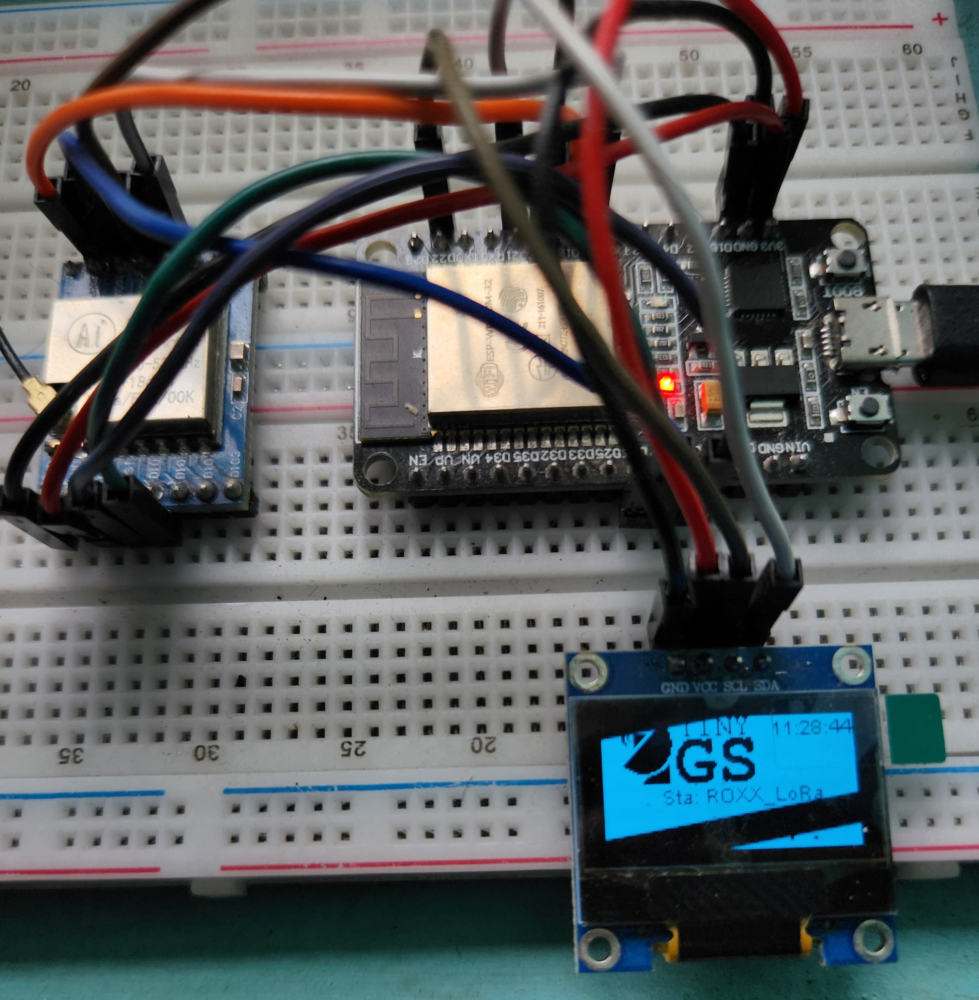
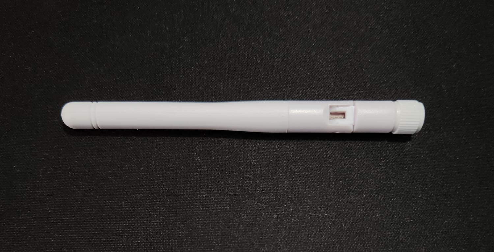
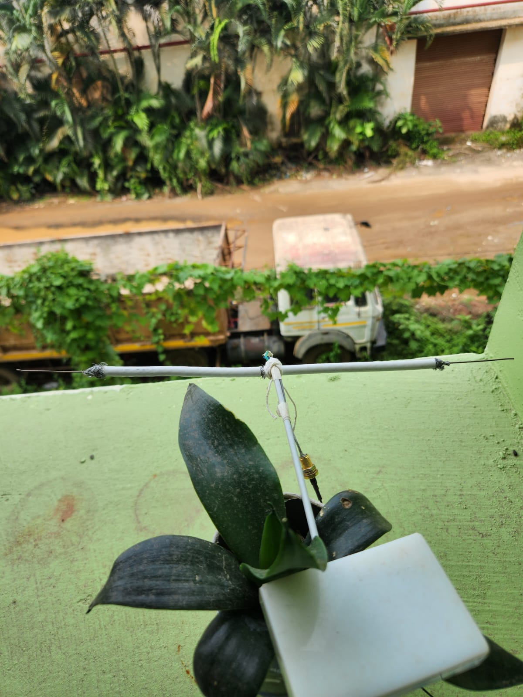
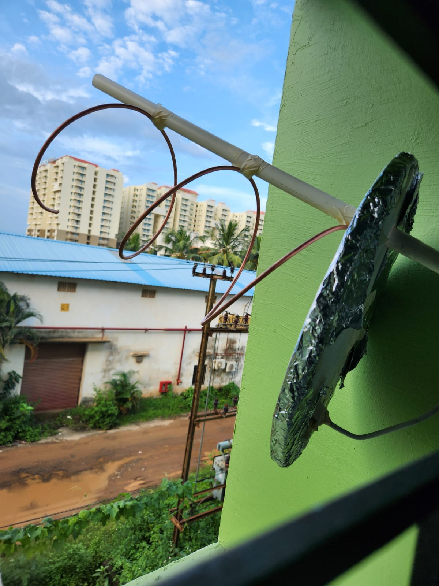

# TinyGS Dash V2

A simple dashboard for TinyGS. 


## Ground Station Setup
For my ground-station setup I am using an ESP-32 ( 30-pin NodeMCU DevKit v1 ) with an AiThinker Ra-02 LoRa ( SX1276 ) module which is connected to an OLED display. 

I am using a custom board template for my setup as the options given in TinyGS does not work with my setup. Feel free to copy and paste the config in your TinyGS dashboard for your setup

```json
{"name":"[433] Custom ESP32 + SX1276","aADDR":60,"oSDA":21,"oSCL":22,"oRST":0,"pBut":0,"led":25,"radio":1,"lNSS":18,"lDIO0":26,"lDIO1":0,"lBUSSY":0,"lRST":14,"lMISO":19,"lMOSI":27,"lSCK":5,"lTCXOV":0}
```




## Antennas
I started with an off the shelf monopole antenna tuned for 433MHz but it wasn't able to capture any packets.



Then I decided to build a double-bazooka dipole antenna with some spare coax cable that I had lying around. It was tuned for 437MHz and it is quite effective. I used this link for calculating the dimensions for it : https://www.i1wqrlinkradio.com/category/proj/calculator-bazooka.html



I also made a helical antenna but it did not work as well as the dipole antenna so I gave up on it and sticked to my trusty old dipole antenna.



## Environment Variables

To run this project, you will need to add the following environment variables to your .env file

`MONGO_URI` :  MongoDB connection string


## Run Locally

Clone the project

```bash
  git clone https://github.com/v3n0m19/tinygs_dashv2/
```

Go to the project directory

```bash
  cd tinygs_dashv2
```

Install dependencies for both frontend and backend

```bash
  cd tinygs-dashv2/backend/
  npm install
  cd tinygs-dashv2/frontend/
  npm install
```

Start the backend server

```bash
  cd tinygs-dashv2/backend/ 
  npm run dev
```

Start the frontend server

```bash
  cd tinygs-dashv2/frontend/
  npm run dev
```


## API Reference

#### Fetch all your captured packets from TinyGS

```
  GET /api/fetch-packets-tinyGS
```


#### Store the captured packets to  MongoDB

```
  POST /api/store-packets-tinyGS
```

| Parameter | Type     | Description                     |
| :-------- | :------- | :-------------------------      |
| `packets` | `json`   | Packets to be stored in your DB |


#### Fetch all stored packets from MongoDB

```
  GET /api/fetch-packets
```

#### Fetch packets for a specific satellite

```
  GET /api/fetch-packet?name=GaoFen
```

| Parameter | Type     | Description                       |
| :-------- | :------- | :-------------------------------- |
| `name`      | `string` | **Required**: Satellite Name whose packets to be fetched|


#### Store all your sat data in MongoDB

```
  GET /api/store-sats

```
#### Fetch all satellite data from MongoDB

```
  GET /api/fetch-packets
```

#### Fetch satellite data for a specific satellite

```
  GET /api/fetch-sat?name=GaoFen
```

| Parameter | Type     | Description                       |
| :-------- | :------- | :-------------------------------- |
| `name`      | `string` | **Required**: Satellite Name whose packets to be fetched|


